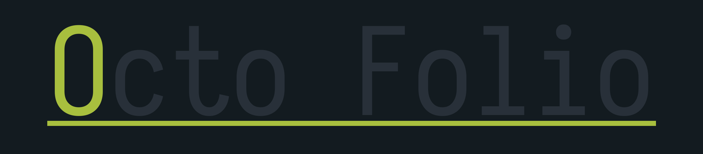
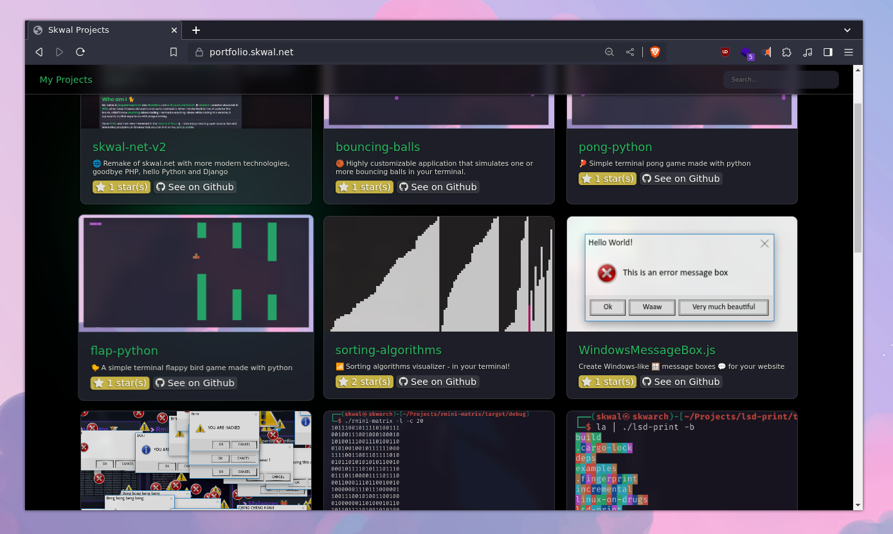

<p align="center">
  
</p>

<p align="center">
  
  
  
  
  

</p>

<p align="center">💠 Simple Vue.js site that show your github profile's repos. 💠</p>


# Preview 



# How to use

#### Step 1 - clone this repository.

```bash
git clone https://github.com/SkwalExe/octo-folio
```

#### Step 2 - install dependencies.

```bash
npm install
```

#### Step 3 - edit the settings.js file.

```bash
nano data/settings.js
```

#### Step 4 - generate a list of your repos.

> [!WARNING]  
> You will need to execute `npm run build` every time you fetch new repos.

```bash
npm run fetch-repos
```

#### Step 5 - Build the frontend.

```bash
npm run build
```

#### Step 6 - serve the project.

You can also serve the project with a web server like nginx or apache.

```bash
npm run serve
```

**Now, go to http://localhost:8008/ and enjoy!**
